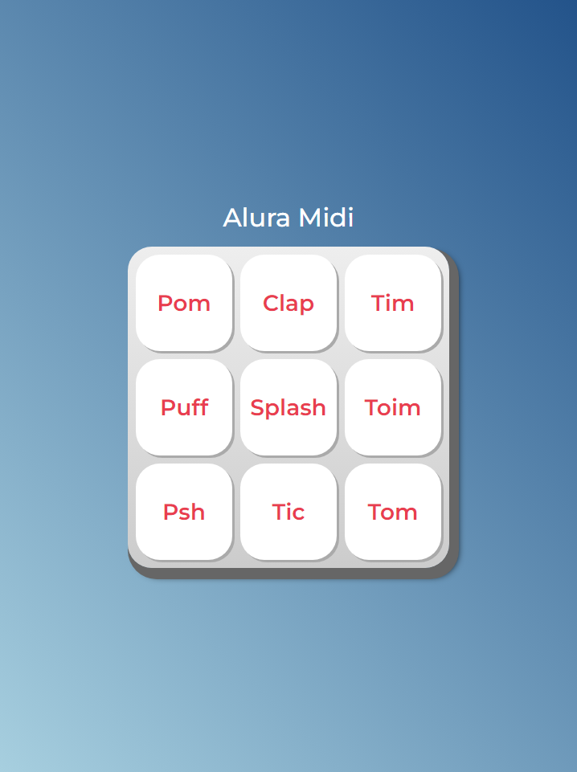

# **Alura Midi**

<!-- PROJECT STATUS -->

> Project Status: ✅ (Concluded)

> Live Code Preview. GitHub Pages: https://preedroos.github.io/alura-midi

 

<!-- TABLE OF CONTENTS -->

  
Table of Contents

  <ol>
    <li>
      <a href="#about-the-project">About The Project</a>
    </li>
    <li><a href="#contributing">Contributing</a></li>
    <li><a href="#contact">Contact</a></li>
    <li><a href="#acknowledgments">Acknowledgments</a></li>
  </ol>

 

<!-- ABOUT THE PROJECT -->

## **About The Project**

A simple sound mixer created with HTML, CSS and a bit of JS.

 

<!-- CONTRIBUTING -->

## **Contributing**

Contributions are what make the open source community such an amazing place to learn, inspire, and create. Any contributions you make are **greatly appreciated**.

If you have a suggestion that would make this better, please fork the repo and create a pull request. You can also simply open an issue with the tag "enhancement".
Don't forget to give the project a star! Thanks again!

1. Fork the Project
2. Create your Feature Branch (`git checkout -b feature/AmazingFeature`)
3. Commit your Changes (`git commit -m 'Add some AmazingFeature'`)
4. Push to the Branch (`git push origin feature/AmazingFeature`)
5. Open a Pull Request

 

<!-- CONTACT -->

## **Contact**

Pedro Paulo Fagundes Cabral

- [GitHub](https://github.com/Preedroos)

- [LinkedIn](https://www.linkedin.com/in/pedropfcabral/)

- [Twitter](https://twitter.com/preedroos)

Email: preedroos@gmail.com

Project Link: [Alura Books](https://github.com/Preedros/alura-midi)

[ <a href="#readme-top">back to top</a> ]

 

<!-- ACKNOWLEDGMENTS -->

## **Acknowledgments**

Some resources that I find helpful and would like to give credit to.

- [JavaScript para Web: Crie páginas dinâmicas](https://cursos.alura.com.br/course/javascript-web-paginas-dinamicas)

[ <a href="#readme-top">back to top</a> ]

